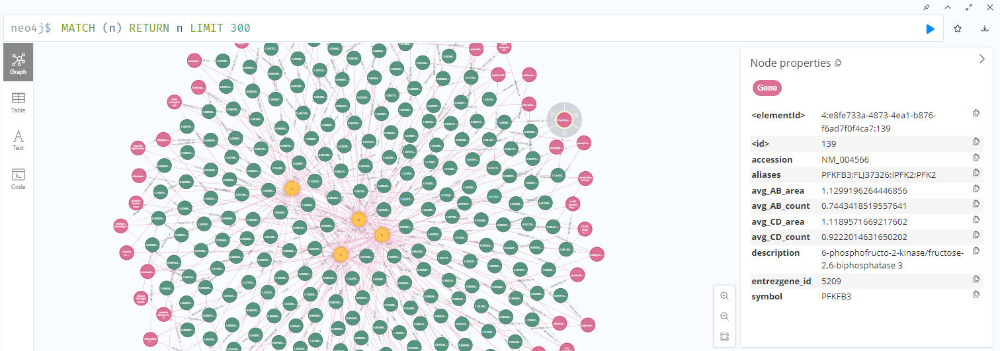

# neo4j_gene_pipeline

This project is in continuation of [cell_microscopy](https://github.com/SalmaKazemiRashed/Cell_Microscopy_project) project.
The results of genome-wide screen analysis gave us the normalized count and average area of nuclei fold change for all genes (18000 nodes.)
Here, I want to have an structured neo4j  graph database built upon the results of that experiment.

### Steps
The steps are :

* Load CSV (results are saved in .csv file)
* Build graph  (convert csv to neo4j graph database using cypher)
* Compute aggregates (The repeated experiments should be handled)
* Expose API (FastAPI) (make the pipeline a real production-like service)
* Query results 

### Nodes
here, we defined graph nodes as 
* genes 
* Experiment (A-B , C-D) (oxidative and non-oxidative stress)
* Measurments (per gene per experiment)

### Relationships
The relationships(edges) in the graph would be like:
```plaintext
(Gene)-[:MEASURED_IN]->(Measurement)-[:FROM_EXPERIMENT]->(Experiment)
```
This design is better than flat features linked to each node as it is scalable and we can see separation of biology vs measurment.

### CSV file
The csv file has following format.
```plaintext
| entrezgene_id | entrezgene_symbols | genbank_accession | aliases                                   | description        | count_decrease_a | area_increase_a | count_decrease_b | area_increase_b | count_decrease_c | area_increase_c | count_decrease_d | area_increase_d |
|---------------|-------------------|-------------------|--------------------------------------------|--------------------|------------------|------------------|------------------|------------------|------------------|------------------|------------------|------------------|
| 7272          | TTK               | NM_003318         | TTK;CT96;ESK;FLJ38280;MPS1;MPS1L1;PYT      | TTK protein kinase | 0.512461         | 1.093648         | 0.713287         | 1.157135         | 0.700742         | 1.048722         | 0.708258         | 1.125556         |
```

For converting the csv data into neo4j graph, we have defined the graph object on neo4j Desktop, set a username (neo4j) and personal password.
Then by defining the neo4j [client](neo4j_client.py) we make connection to the database.[Ingest](ingest.py) function transfer all data in .csv file to graph data with following design.

We have 90604 total nodes calculated with following query:

```cypher
MATCH (n)
RETURN count(n) AS total_nodes
```
using neo4j browser console.

and 144960 edges (relationships)
```cypher
MATCH ()-[r]->()
RETURN count(r) AS total_relationships
```

The total number of nodes in our graph would be :

```plaintext
Measurements = 4 × Genes
MEASURED_IN edges = 4 × Genes
FROM_EXPERIMENT edges = 4 × Genes
Experiments = 4 (A,B,C,D)
```

After data ingestion we have defined  different functions in [queries](queries.py) runnable through fastapi app:
```bash
uvicorn main:app --reload
```
uvicorn is runnable on http://127.0.0.1:8000 and each function result is asscessible at its own endpoint such as http://127.0.0.1:8000/top-genes 


or functions with input on
e.g., http://127.0.0.1:8000/filter?area_min=0.5&area_max=5&count_min=-5&count_max=0.


We also visualized graph through neo4j browser and a small subgraph of our data is as following:
